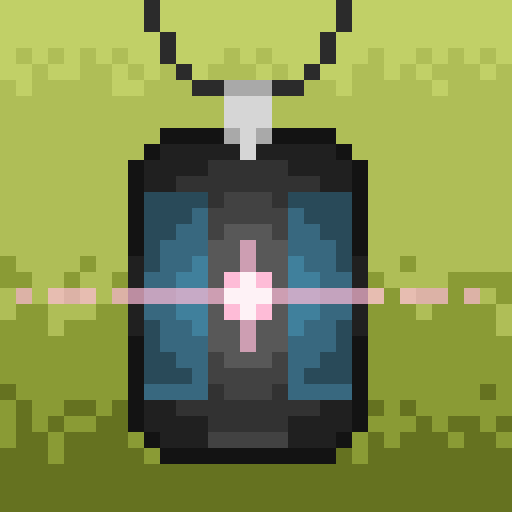
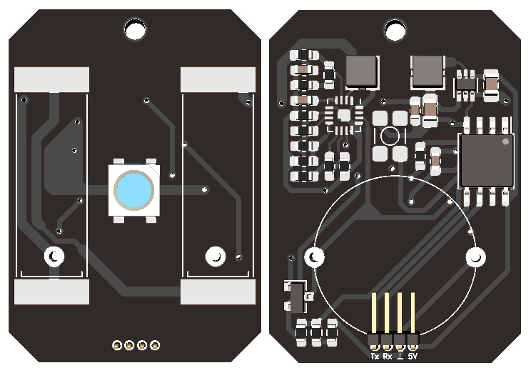
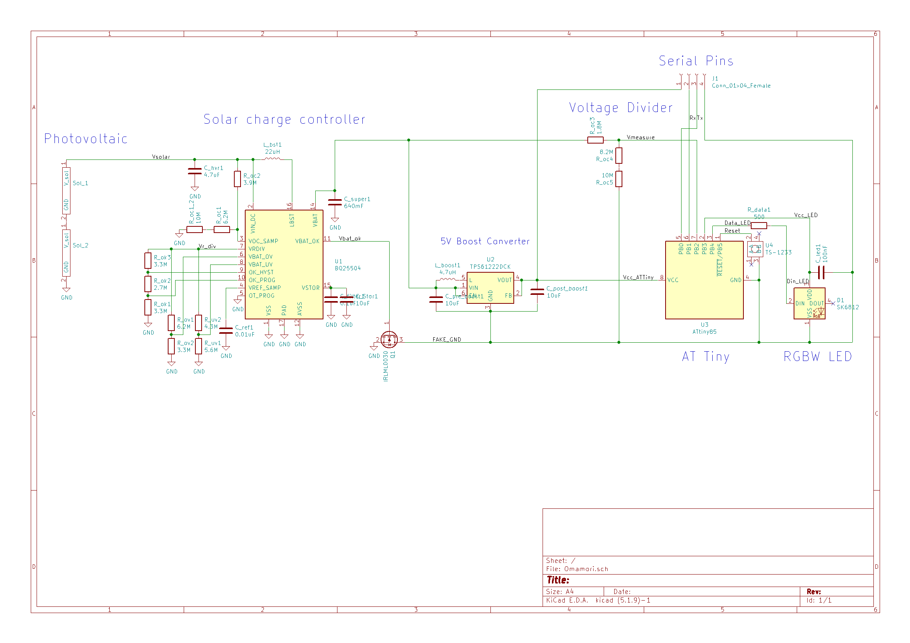
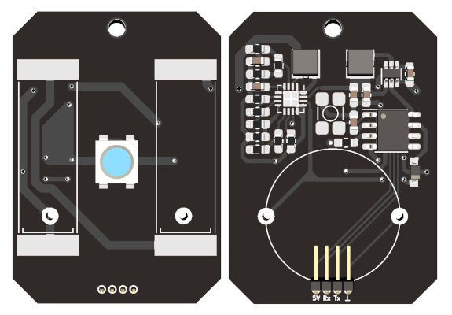
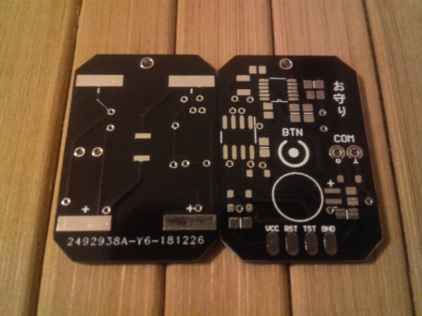

# Omamori

\
Omamori is a solar-powered LED pendant for necklaces.
I have got the motivation to realize this project during my time in university, when I first designed PCBs, even though I had the idea for much longer.
At first, I was using Altium Designer, which was used by my university. Later in Version 2.0 I switched to KiCad, which is a gem of software, which was recommended to me by Andreas (Thank you!).
Thank you as well for helping me with the soldering and designing, Andreas and Markus.
  

## History
[Version 0.2.1](#Version-021) \
[Version 0.2.0](#Version-020) \
[Version 0.1.0](#Version-010)
  

## Version 0.2.1

\
Hardware as in Version 0.2.0 except a few resistors instead of the diode for measuring battery voltage and an IRLML2502TRPBF N-Channel MOSFET for switching the 5V boost converter.
  

## Version 0.2.0

\
**MCU:** 1x ATTiny 85 \
**Energy Harvester:** 1x BQ25504 \
**Solar Cells:** 2x KXOB25-05X3F \
**Boost Converter:** 1x TPS61222 \
**LED:** 1x SK6812 programmable RGBW LED
  

## Version 0.1.0

\
**MCU:** 1x MSP430G2210 \
**Energy Harvester:** 1x LTC3105 \
**Solar Cells:** 2x KXOB22-04X3L 1.5Vmpp \
**LED:** 1x Natural White LED
