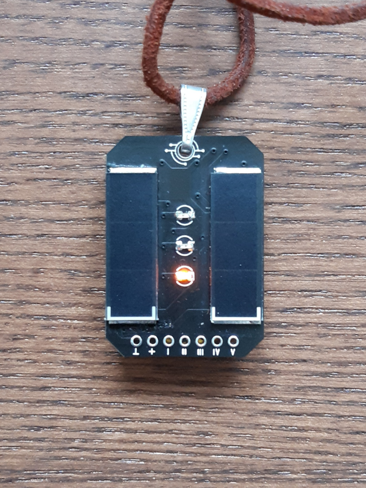
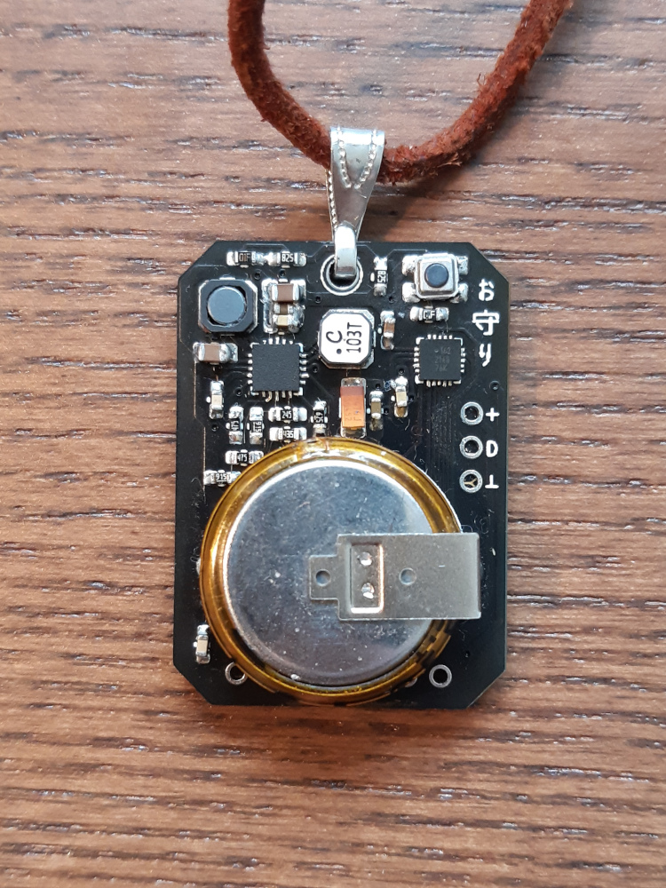
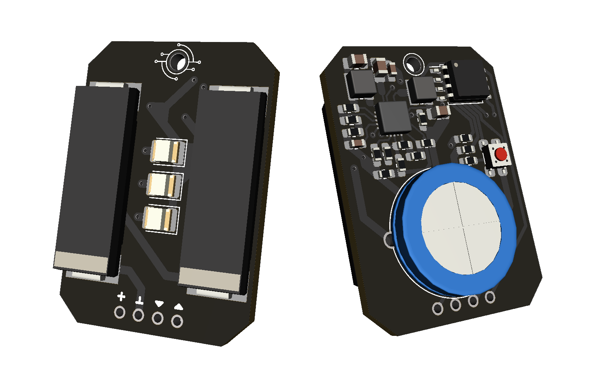

# Omamori

\
Omamori is a solar-powered LED lucky and protector charm.<br>
I have got the motivation to realize this project during my time in university, when I first designed PCBs, even though I had the idea for much longer. At first, I was using Altium Designer, which was used by my university. Later since version 2.0 I switched to KiCad, which is a gem of software, which was recommended to me by Andreas.<br>
A huge thank you for helping me with soldering, designing, listening and keeping my motivation up to:<br>
Andreas, Markus, Patrick, Anna-Lena, Flopsi, Stephan and many others! ♥️<br>
<br>

## Programming

Program ATTiny 1626 via UPDI pins on the back of the PCB.  
Set the internal clock to 1MHz and use a low uploading BAUD to make sure the microcontroller can keep up.  

<br><br>

# History

A version History of the Omamori project.

[Version 0.3.1](#Version-030) \
[Version 0.3.0](#Version-030) \
[Version 0.2.1](#Version-021) \
[Version 0.2.0](#Version-020) \
[Version 0.1.0](#Version-010)
<br><br>

## Version 0.3.1



\
Hardware as in Version 0.3.0 except that a few capacitors are closer to the BQ25570 and I added a few other transistors for stability. Everything is working as expected.  
I consider this the final version for now.  

<br><br>

## Version 0.3.0


\
**MCU:** 1x ATTiny 1626 \
**Energy Harvester:** 1x BQ25570 \
**Solar Cells:** 2x KXOB25-05X3F \
**LEDS:** 3x Orange 0805 SMD LED

<br><br>

## Version 0.2.1


\
Hardware as in Version 0.2.0 except a few resistors instead of the diode for measuring battery voltage and an IRLML2502 N-Channel MOSFET for switching the 5V boost converter.
This version works, but has a very short supercap lifetime. Therefore the next version has to be a lot more efficient.

<br><br>

## Version 0.2.0

\
**MCU:** 1x ATTiny 85 \
**Energy Harvester:** 1x BQ25504 \
**Solar Cells:** 2x KXOB25-05X3F \
**Boost Converter:** 1x TPS61222 \
**LED:** 1x SK6812 programmable RGBW LED

### Energy Harvester (BQ25504) properties

```
V_REF_SAMP    = 3.33V (R_OC1 = 6.2 MOhm + 10 MOhm = 16.2 MOhm, R_OC2 = 3.9 MOhm)
V_BAT_UV      = 2.21V (R_UV1 = 5.6 MOhm, R_UV2 = 4.3MOhm)
V_BAT_OK      = 2.27V (R_OK1 = 3.3 MOhm, R_OK2 = 2.7 MOhm, R_OK3 = 3.3 MOhm)
V_BAT_OK_HYST = 3.52V
V_BAT_OV      = 5.42V (R_OV1 = 3.6 MOhm, R_OV2 = 6.8 MOhm)
```

<br><br>

## Version 0.1.0

\
**MCU:** 1x MSP430G2210 \
**Energy Harvester:** 1x LTC3105 \
**Solar Cells:** 2x KXOB22-04X3L 1.5Vmpp \
**LED:** 1x Natural White LED
