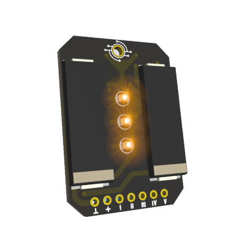
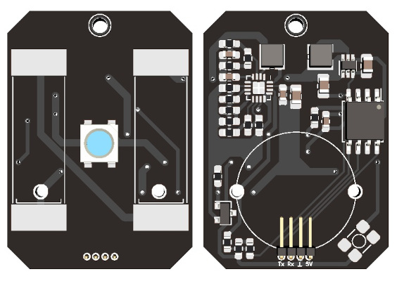

# Omamori

\
Omamori is a solar-powered LED lucky and protector charm.<br>
I have got the motivation to realize this project during my time in university, when I first designed PCBs, even though I had the idea for much longer. At first, I was using Altium Designer, which was used by my university. Later since version 2.0 I switched to KiCad, which is a gem of software, which was recommended to me by Andreas.<br>
A huge thank you for helping me with soldering, designing, listening and keeping my motivation up to:<br>
Andreas, Markus, Anna-Lena, Flopsi, Stephan and many others! <3<br>
<br>

## Programming

Set internal clock to 8MHz -> Burn Bootloader and Flash Software<br>
Serial: 19200 BAUD<br>Reset the MCU and send a command within the first 5 seconds (Blinks once when serial communication is enabled, and another time when it is disabled)

### Serial Protocol and commands:

```
<cmd>:<values (if needed)>;

List of commands:
STA;                                                    // Get Status
SLP:<1-100>;                                            // Set sleep time between blinks
```

<br><br>

# History

A version History of the Omamori project.

[Version 0.3.0](#Version-030) \
[Version 0.2.1](#Version-021) \
[Version 0.2.0](#Version-020) \
[Version 0.1.0](#Version-010)
<br><br>

## Version 0.3.0


\
**MCU:** 1x ATTiny 85 \
**Energy Harvester:** 1x BQ25570 \
**Solar Cells:** 2x KXOB25-05X3F \
**LEDS:** 3x Orange 1210 SMD LED

### Energy Harvester (BQ25504) properties

```
V_REF_SAMP    = 80% of PV OCV = MPP (Default)
V_BAT_UV      = 1.95V (Deafult)
V_BAT_OK      = 2V (R_OK1 = 6.2 MOhm, R_OK2 = 4.3 MOhm, R_OK3 = 2.4 MOhm)
V_BAT_OK_HYST = 2.5V
V_BAT_OV      = 5.5V (R_OV1 = 4.3MOhm, R_OV2 = 8.6MOhm)
V_OUT         = 1.8V (R_OUT1 = 8.2MOhm, R_OUT2 = 4.3MOhm)
```

<br><br>

## Version 0.2.1


\
Hardware as in Version 0.2.0 except a few resistors instead of the diode for measuring battery voltage and an IRLML2502 N-Channel MOSFET for switching the 5V boost converter.
This version works, but has a very short supercap lifetime. Therefore the next version has to be a lot more efficient.

<br><br>

## Version 0.2.0

\
**MCU:** 1x ATTiny 85 \
**Energy Harvester:** 1x BQ25504 \
**Solar Cells:** 2x KXOB25-05X3F \
**Boost Converter:** 1x TPS61222 \
**LED:** 1x SK6812 programmable RGBW LED

### Energy Harvester (BQ25504) properties

```
V_REF_SAMP    = 3.33V (R_OC1 = 6.2 MOhm + 10 MOhm = 16.2 MOhm, R_OC2 = 3.9 MOhm)
V_BAT_UV      = 2.21V (R_UV1 = 5.6 MOhm, R_UV2 = 4.3MOhm)
V_BAT_OK      = 2.27V (R_OK1 = 3.3 MOhm, R_OK2 = 2.7 MOhm, R_OK3 = 3.3 MOhm)
V_BAT_OK_HYST = 3.52V
V_BAT_OV      = 5.42V (R_OV1 = 3.6 MOhm, R_OV2 = 6.8 MOhm)
```

<br><br>

## Version 0.1.0

\
**MCU:** 1x MSP430G2210 \
**Energy Harvester:** 1x LTC3105 \
**Solar Cells:** 2x KXOB22-04X3L 1.5Vmpp \
**LED:** 1x Natural White LED
